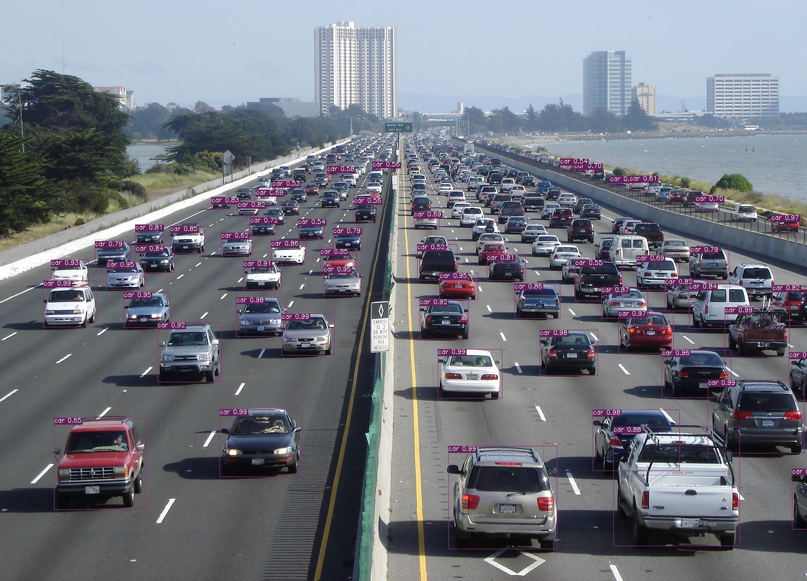
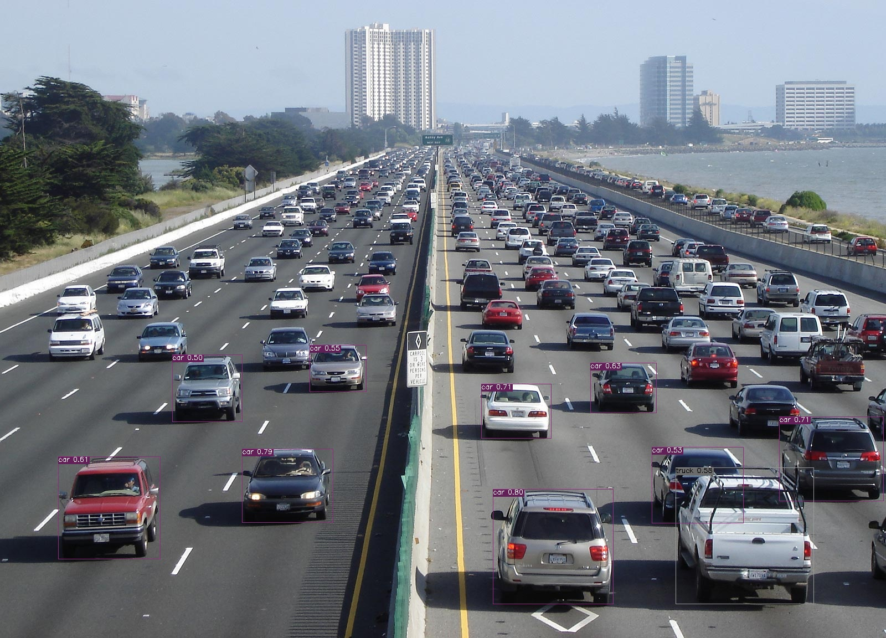

<div align="center">
<h1>
DetHub: Object Detection Model Hub
</h1>

</div>

### Installation
```
git clone https://github.com/kadirnar/dethub
cd dethub
pip install -r requirements.txt
```
### Yolov5 Object Prediction and Visualization
```
run('yolov5', 'dethub/models/yolov5/yolov5n.pt', 'data/highway1.jpg')
```


### Torchvision Object Prediction and Visualization
```
run("torchvision", "dethub/models/torchvision/fasterrcnn_resnet50_fpn.pth", "data/highway1.jpg")
```


### TfHub Object Prediction and Visualization
```
run('tensorflow', 'https://tfhub.dev/tensorflow/efficientdet/d3/1', 'data/highway1.jpg')
```


### Contributing
Before opening a PR:
- Reformat with black and isort:
```bash
black . --config pyproject.toml
isort .
```
References:
- [SAHI](https://github.com/obss/sahi)
- [YOLOX](https://github.com/Megvii-BaseDetection/YOLOX)
- [Mcvarer](https://github.com/mcvarer/coco_toolkit)
