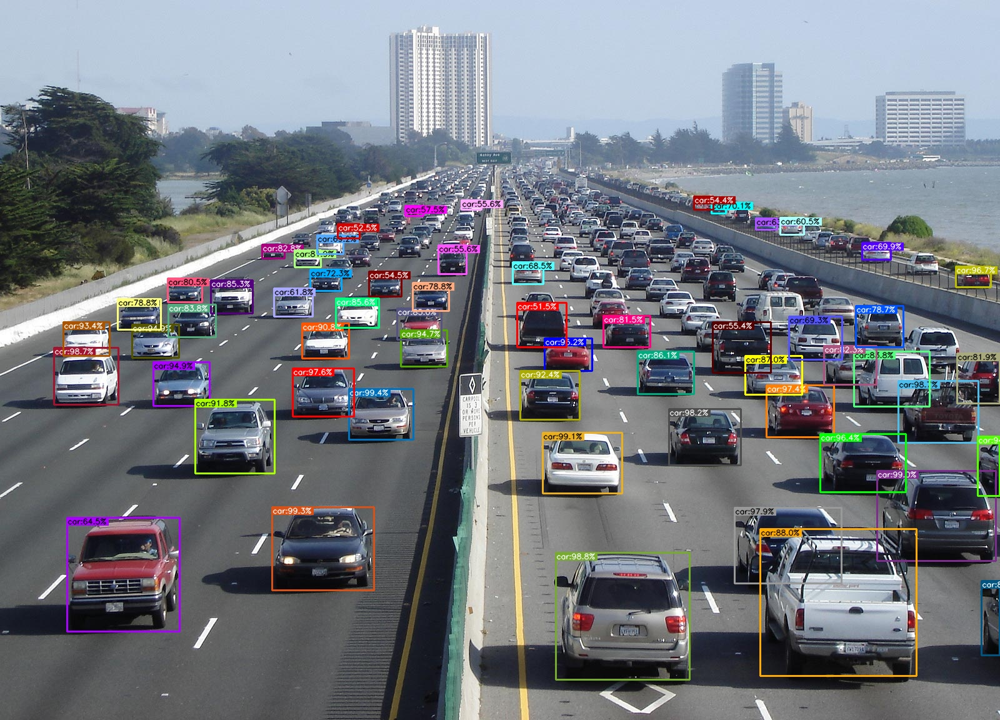
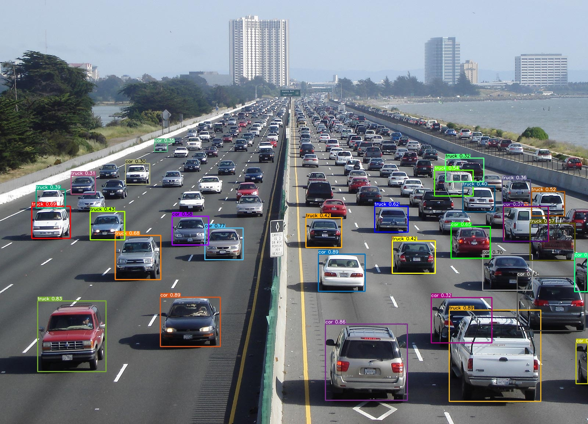
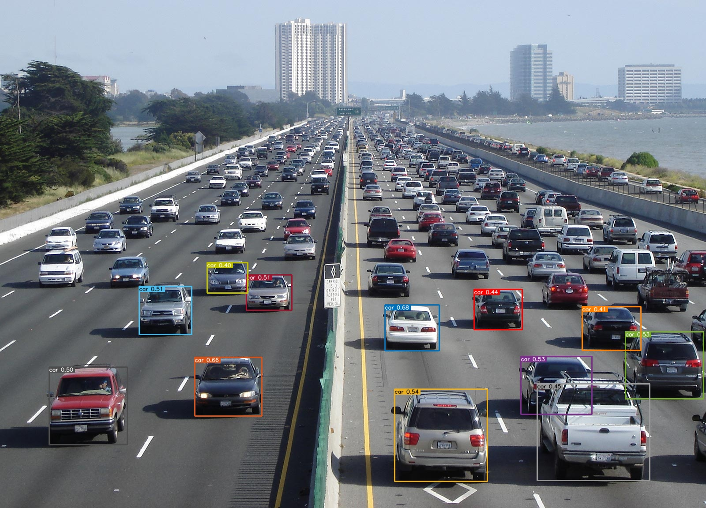

<div align="center">
<h1>
DetHub: Object Detection Model Hub
</h1>

</div>

### Yolov5 Object Prediction and Visualization
```
import cv2        
img = cv2.imread('dethub/data/highway1.jpg')   
model_path = "dethub/models/yolov5/yolov5x.pt"
pred = torchvision_predict(img, model_file, 0.5, "cpu")
```
#### Output:
```
{
'bbox': [448, 310, 494, 342], 
'score': 0.73421854, 
'category_name': 'car'
}
```


### Torchvision Object Prediction and Visualization
```
import cv2
img = cv2.imread('dethub/data/highway1.jpg')   
model_file = "models/torchvision/fasterrcnn_resnet50_fpn.pth"
pred = torchvision_predict(img, model_file, 0.5, "cpu")
```
#### Output:
```
[[[(941.08374, 1228.0343), (1012.77856, 1321.7717)], 'truck', 0.8594939], 
[[(2614.4521, 1528.8745), (2845.1682, 1676.0325)], 'car', 0.8239291]]
```


### TfHub Object Prediction and Visualization
```
model_file = "https://tfhub.dev/tensorflow/efficientdet/d0/1"
img_file = "dethub/data/highway1.jpg"
label_file = "dethub/data/coco_label.txt"
tfhub_predict(img_file, model_file, "cpu", 0.4, label_file)
```
#### Output:
```
[
(<tf.Tensor: shape=(4,), dtype=float32, numpy=array([0.6000975 , 0.545297  , 0.6901894 , 0.62193394], dtype=float32)>, 
<tf.Tensor: shape=(), dtype=float32, numpy=3.0>, <tf.Tensor: shape=(), dtype=float32, numpy=0.67898685>)
]
```


## TODO
- [ ] Torchvision will simplify.
- [ ] Detectron2 will be added.
- [ ] TfHub will be added.
- [ ] Torch Hub will be added.
- [ ] Hugging Face will be added.
- [ ] Visualization and model files will be made more functional.

References:
- [SAHI](https://github.com/obss/sahi)
- [YOLOX](https://github.com/Megvii-BaseDetection/YOLOX)
